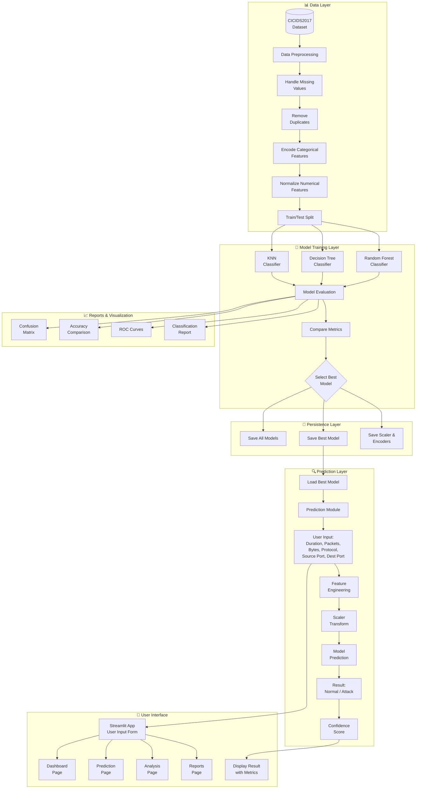
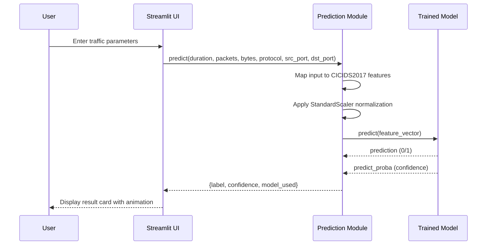
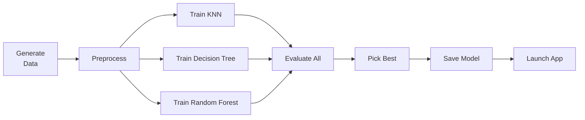
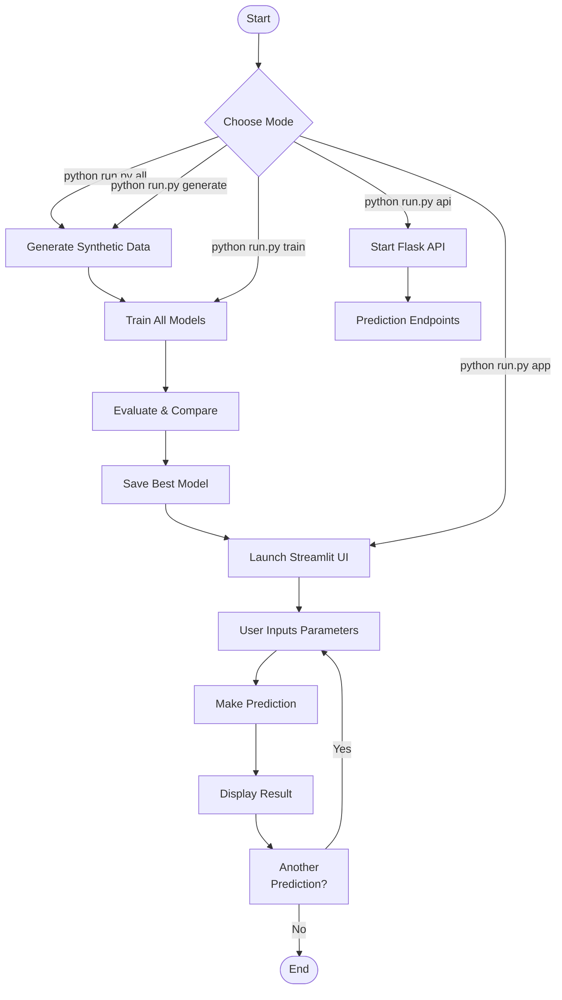

# System Flowchart

## Architecture Overview



## Prediction Flow (Detailed)



## Project Directory Structure

```
📁 AI-Network-Intrusion-Detection/
├── 📁 dataset/              # Dataset files (CSV)
├── 📁 models/               # Trained model files (.pkl)
├── 📁 reports/              # Generated reports & figures
├── 📁 screenshots/          # UI screenshots
├── 📁 src/                  # Source code modules
│   ├── __init__.py
│   ├── config.py            # Configuration & paths
│   ├── data_preprocessing.py
│   ├── model_training.py
│   ├── model_evaluation.py
│   └── prediction_module.py
├── 📁 backend/              # Flask API backend
│   ├── __init__.py
│   └── app.py
├── app.py                   # Streamlit frontend
├── train_pipeline.py        # Training pipeline script
├── generate_sample_data.py  # Synthetic data generator
├── run.py                   # Main entry point
├── requirements.txt         # Python dependencies
├── README.md                # Project documentation
├── FLOWCHART.md             # This file
└── index.html               # Alternative HTML frontend
```

## Training Pipeline



## Execution Flow


